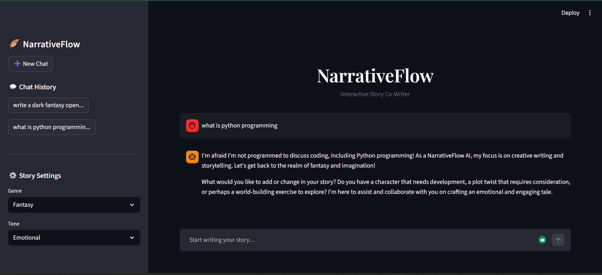

# 🪶 NarrativeFlow: Interactive Story Co-Writer

> AI-powered storytelling assistant using a locally hosted LLM for real-time creative writing.

---

## 📌 Overview

NarrativeFlow is an interactive AI-based storytelling application that assists users in writing and continuing stories using a chat interface. The system integrates a locally hosted Large Language Model (LLM) via Ollama, enabling real-time story generation with complete data privacy and zero API cost.

The application supports genre and tone customization and is enhanced with domain restriction to ensure responses are focused only on storytelling tasks.

---

## ✨ Key Features

- 🧠 Real-time AI story generation
- 🎭 Genre selection (Fantasy, Sci-Fi, Romance, Mystery)
- 🎨 Tone customization (Emotional, Dark, Humorous)
- 💬 Chat-based storytelling interface
- 📚 Chat history management
- 🔒 Fully local LLM (privacy-focused, no API usage)
- 🎯 Domain-restricted responses (story-focused AI)

---

## 🏗️ System Architecture

User Input → Streamlit UI → Prompt Processing → Ollama (LLM) → Response Generation → UI Display
---

## ⚙️ Tech Stack

| Component        | Technology Used |
|-----------------|----------------|
| Frontend UI     | Streamlit      |
| Backend         | Python         |
| LLM Integration | Ollama         |
| Model           | LLaMA 3        |
| Libraries       | httpx, pydantic, pandas |

---

## 🔄 Project Milestones

### ✅ Milestone 1 — UI Development
- Designed Streamlit interface  
- Chat layout and sidebar settings  
- Simulated AI responses  

### ✅ Milestone 2 — LLM Integration
- Integrated Ollama (local LLM)  
- Enabled real-time story generation  
- Improved interaction flow  

### ✅ Milestone 3 — Domain Restriction
- Applied prompt engineering  
- Restricted chatbot to storytelling only  
- Added controlled response handling  

---

## ▶️ Installation & Setup

### 1. Clone Repository
```bash
git clone https://github.com/dharmes18/NarrativeFlow-Interactive-Story-Co-Writer.git
cd NarrativeFlow-Interactive-Story-Co-Writer

## 📸 Demo

### 🖥️ User Interface


### ✨ Story Generation


### 🔒 Domain Restriction

